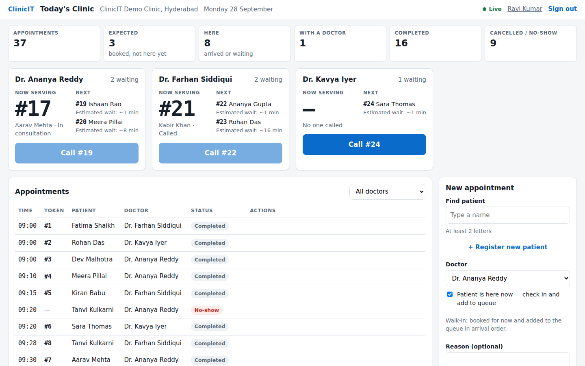
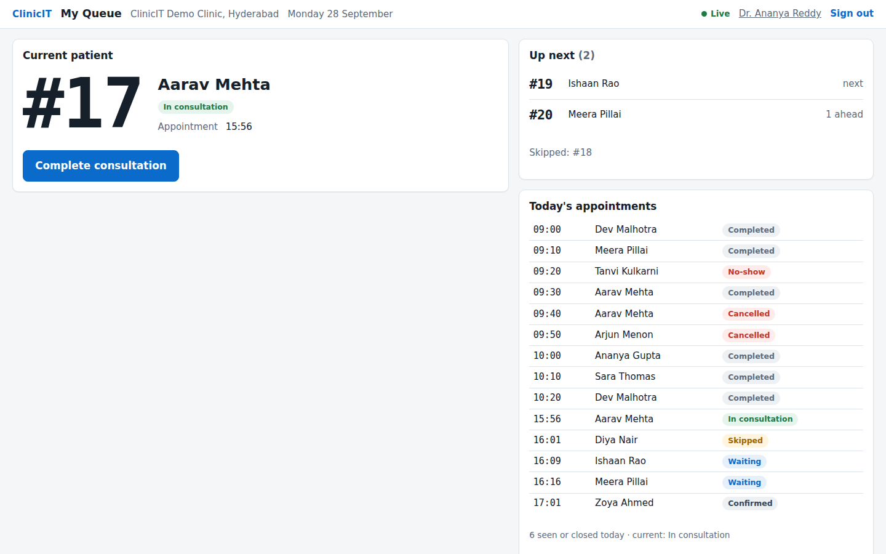
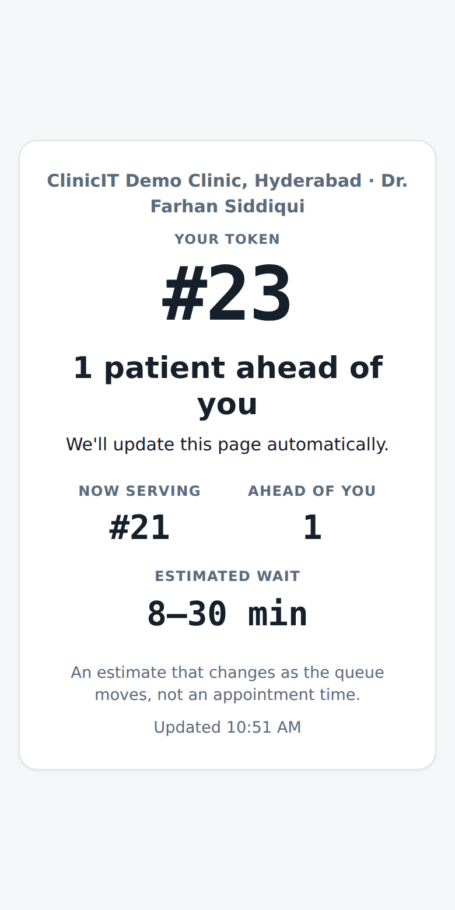
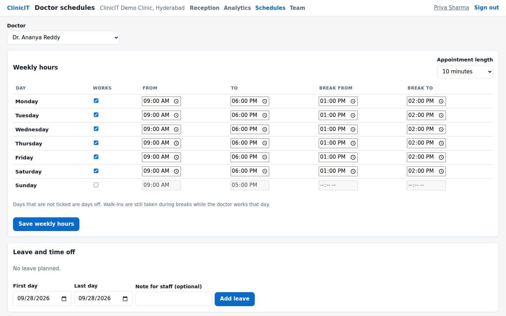

# ClinicIT

Queue and appointment management for small outpatient clinics: booking, walk-ins, a live token queue for reception
and doctors, a phone-friendly status page for patients, doctor schedules, and the day's figures.



| Doctor's queue | Patient's phone | Doctor schedules |
|---|---|---|
|  |  |  |

All screenshots show the fictional [demo clinic](docs/DEMO.md). The analytics screen is
[here](docs/screenshots/analytics.png).

## Try it

```bash
docker compose up --build        # then open http://localhost:3000
```

The first start loads **ClinicIT Demo Clinic, Hyderabad**: three doctors, 18 fictional patients, two weeks of history
and today's queue with patients in every state.

| Sign in as | Email | Password |
|---|---|---|
| Admin | `admin@demo.clinicit.local` | `local-demo-only-2026` |
| Receptionist | `reception@demo.clinicit.local` | same |
| Doctor | `ananya.reddy@demo.clinicit.local` (also `farhan.siddiqui@…`, `kavya.iyer@…`) | same |

- **Credentials:** these are local demo credentials, published on purpose. To change the password, set
  `CLINICIT_DEMO_PASSWORD` in a `.env` file before the first start.
- **Scope:** everything binds to 127.0.0.1, and the stack is for evaluation only; production refuses demo data.
- **Reset:** `docker compose down -v` removes everything.

## What it does

- **Reception**:
  - register and find patients;
  - book a free slot, or check in a walk-in in one click;
  - confirm, mark arrived, add to the queue, call, skip, requeue, record a no-show, cancel, reschedule;
  - today's counts; every doctor's queue, live.
- **Doctors** see their current patient, who is next, and the day's list. They call next, start, complete, skip or
  record a no-show.
- **Patients** follow their token on a private link (no account). It shows the token now serving, how many are
  ahead, "You're next" and "It's your turn", and an approximate wait range. The page updates by itself.
- **Admins**:
  - manage doctors, staff logins, roles and the clinic name;
  - set weekly hours, breaks, appointment length and leave;
  - see today's figures, 14-day trends, doctor workload and utilization.
- **Wait estimates** come from a small ML model (optional) with a deterministic fallback. They are advisory ranges,
  never promises.
- **No-show risk:** an advisory flag suggests a reminder call. It is a transparent rule, and its evaluation on the
  clinic's own history is shown next to it.

## Architecture

```
 Browser (Next.js)  ──REST + STOMP/WebSocket──▶  Spring Boot API (one instance)  ──▶  PostgreSQL 16
 Patient's phone    ──public status (polling)─▶        │                                   ▲
                                                       └──HTTP, 0.8 s budget──▶  ML service (FastAPI, optional)
```

A **modular monolith**:

| Module | Covers |
|---|---|
| identity | sessions and roles |
| clinic | clinic and doctors |
| patient | patients |
| appointment | appointments |
| queue | the queue engine |
| schedule | doctor schedules and booking rules |
| realtime | live updates over WebSocket |
| notification | patient messages (outbox) |
| history | the immutable event history |
| analytics | figures computed from the history |
| prediction | wait estimates |
| noshow | the no-show risk flag |
| demo | the demo clinic |

PostgreSQL is the only store; there is no Redis or message broker. A few decisions carry most of the weight:

- **Tokens and concurrency:**
  - A token is unique per clinic per day, allocated by an atomic counter upsert, never `MAX + 1`.
  - "Call next" locks the doctor row and skips rows already locked.
  - A partial unique index allows one active patient per doctor.
  - Bookings take the same doctor lock, so one slot cannot be sold twice.
  - Concurrency tests against real PostgreSQL prove each of these ([QUEUE_ENGINE.md](docs/QUEUE_ENGINE.md),
    [SCHEDULING.md](docs/SCHEDULING.md)).
- **Clinic isolation everywhere:** every query is scoped to the caller's clinic, and composite foreign keys make the
  database reject cross-clinic references too ([SECURITY.md](docs/SECURITY.md)).
- **An immutable history** (append-only, enforced by a trigger) drives analytics, wait-estimate features and the
  no-show evaluation. Past judgements use only what was known at the time.
- **Outboxes** for live updates and patient messages. Notifications are at-least-once, with idempotency keys and
  leases.
- **Time:** appointments and schedules are clinic wall-clock time; events are instants. The server's zone is never
  used, and tests run in a different zone to prove it.

## Stack

- **Backend:** Java 21, Spring Boot 3.5 (Web, Security, Data JPA, JDBC, WebSocket/STOMP, Actuator + Micrometer),
  Flyway, PostgreSQL 16.
- **Frontend:** Next.js 16, React 19, TypeScript (`frontend/`).
- **ML:** Python 3.11, FastAPI, scikit-learn (`ml/`).
- **Tests and delivery:**
  - JUnit 5 against real PostgreSQL, pytest, Vitest + Testing Library, and Playwright end to end;
  - GitHub Actions: backend, ML, frontend, browser E2E and a Docker Compose smoke test on every pull request;
  - Docker images for all three services.

## Development

```bash
# Backend (needs a PostgreSQL database whose name contains "test": every table is truncated)
CLINICIT_TEST_DB_URL=jdbc:postgresql://localhost:5432/clinicit_test CLINICIT_TEST_DB_USERNAME=postgres mvn verify

# ML service
cd ml && python3 -m venv .venv && .venv/bin/pip install -r requirements-dev.txt && .venv/bin/python -m pytest

# Frontend
cd frontend && npm ci && npm test && npm run typecheck && npm run lint && npm run build

# Everything in a real browser: builds and starts the ML service, API and web app against a throwaway database
DB_URL=jdbc:postgresql://localhost:5432/clinicit_e2e DB_USERNAME=postgres DB_PASSWORD=<password> scripts/e2e.sh
```

To run the app without Docker:
- **API:** `mvn spring-boot:run`, with `CLINICIT_CORS_ALLOWED_ORIGINS=http://localhost:3000` and either
  `CLINICIT_DEMO_ENABLED=true` + `CLINICIT_DEMO_PASSWORD=…` or the `CLINICIT_BOOTSTRAP_*` variables for a first admin.
- **Web app:** `npm run dev` in `frontend/`.
- **ML service (optional):** see [`ml/README.md`](ml/README.md).

What each test suite proves is in [docs/TESTING.md](docs/TESTING.md).

## Production

Deploy with `SPRING_PROFILES_ACTIVE=prod`:
- **Unsafe configuration:** the API refuses to start with missing or unsafe settings (development passwords,
  wildcard or plain-HTTP CORS, demo data, the development notification provider…) and lists them all.
- **Monitoring:** health probes and Prometheus metrics are on an internal port.
- **Instances:** run one API instance; the in-memory WebSocket broker is the documented scaling boundary.

Guides:
- [docs/DEPLOYMENT.md](docs/DEPLOYMENT.md): Vercel + Render/Railway + managed PostgreSQL.
- [docs/OPERATIONS.md](docs/OPERATIONS.md): configuration, probes, metrics and logging.

## Documentation

| | |
|---|---|
| [Product spec](docs/PRODUCT_SPEC.md), [Architecture](docs/ARCHITECTURE.md), [Data model](docs/DATA_MODEL.md), [API](docs/API.md) | what it is and how it fits together |
| [Queue engine](docs/QUEUE_ENGINE.md), [Scheduling](docs/SCHEDULING.md) | the core rules, locking and the time model |
| [Security](docs/SECURITY.md) | sessions, roles, clinic isolation, the public status page |
| [Real-time](docs/REALTIME.md), [Notifications](docs/NOTIFICATIONS.md) | live updates and patient messages |
| [Analytics](docs/ANALYTICS.md), [AI: wait times](docs/AI.md), [No-show risk](docs/NO_SHOW_RISK.md) | figures and advisory estimates, with their definitions and limits |
| [Frontend](docs/FRONTEND.md), [Demo clinic](docs/DEMO.md) | the screens and the demo data |
| [Operations](docs/OPERATIONS.md), [Deployment](docs/DEPLOYMENT.md), [Testing](docs/TESTING.md), [Review](docs/REVIEW.md) | running it, testing it, and an honest assessment |

## What's built

| Phase | |
|---|---|
| 0–2 | Architecture; patients and appointments; the concurrent queue engine |
| 3–5 | Authentication, roles and clinic isolation; the live queue over WebSockets; the web app |
| 6–8 | Patient notifications (outbox); immutable history and analytics; the wait-time model with fallback |
| 9 | CI/CD and production hardening: safe configuration, probes, metrics, request ids, rate limiting, Docker |
| 10 | Doctor scheduling: hours, breaks, leave, slots, walk-ins, rescheduling |
| 11 | Team and clinic admin, reception counts, trends, the demo clinic |
| 12 | Advisory no-show risk with a temporal evaluation; account page; deployment guide |

## Roadmap

- **A real SMS/WhatsApp provider** behind the existing notification interface. Production currently runs with
  notifications off.
- **More than one API instance:** a shared broker (STOMP relay or PostgreSQL `LISTEN/NOTIFY`) for live updates.
- **Real clinic data** to retrain and re-evaluate the wait-time model. It is trained on a simulation today.
- **Password reset by email,** and optional two-factor sign-in for admins.
- **Per-date schedule exceptions,** if clinics need more than weekly hours plus leave.

## Responsible use

ClinicIT is an operational system, not a clinical one.
- **Wait estimates** only estimate waiting time.
- **The no-show flag** is a reminder prompt.
- **Neither** diagnoses, prescribes, prioritises patients, refuses care or makes clinical decisions
  ([AI.md](docs/AI.md), [NO_SHOW_RISK.md](docs/NO_SHOW_RISK.md)).
